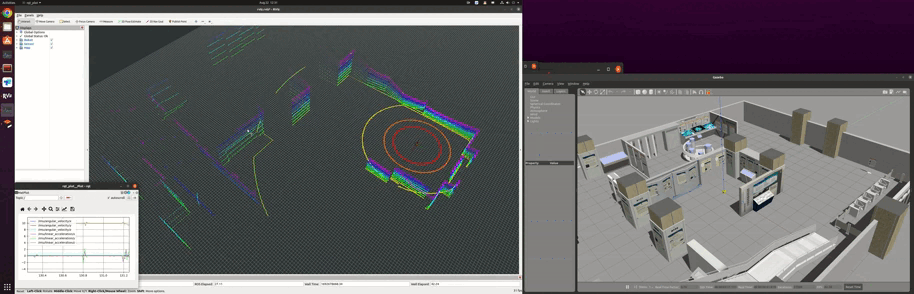

# agi_sim
**A repo. which maintains simulation tools in gazebo for agi-robotics.**

**The main branch is  developed on ros1 noetic.**



## Dependencies

1. ros1 noetic

2. gazebo11

3. velodyne

   ```bash
   sudo apt install ros-noetic-velodyne*
   ```

4. joystick

   ```bash
   sudo apt-get install joystick ros-noetic-joy ros-noetic-teleop-twist-joy 
   ls -l /dev/input/js0
   sudo jstest /dev/input/js0
   rosrun joy joy_node
   rostopic echo joy
   ```
   
   Add configuration for joystick like below and set the configuration filename as parameter `joy_config`  in `test_joy.launch`.
   
   ```yaml
   # Joystick axis to use for linear movement control.  
   axis_linear: 7  
   # Scale to apply to joystick linear axis for regular-speed movement, in m/s.
   scale_linear: 0.5 
   # Scale to apply to joystick linear axis for high-speed movement, in m/s.
   scale_linear_turbo: 1.0 
   
   # Joystick axis to use for angular movement control.
   axis_angular: 6
   # Scale to apply to joystick linear axis for regular-speed movement, in m/s.
   scale_angular: 1.0 
   # Scale to apply to joystick angular axis for high-speed movement, in rad/s.
   scale_angular_turbo: 1.0 
   
   enable_button: 6 # regular-speed
   enable_turbo_button: 8 # high-speed
   ```
   
   Then test `ros-noetic-teleop-twist-joy` node.
   
   ```bash
   roslaunch diff_car test_joy.launch
   
   # topic echo joy & cmd_vel
   rostopic echo /joy
   rostopic echo /cmd_vel
   ```

## Run

```bash
git clone https://github.com/zhan994/agi_sim.git
cd agi_sim
catkin_make

# >>>>>>>>>>>>>>>>>>>> with joy <<<<<<<<<<<<<<<<<<<<
roslaunch diff_car gazebo_joy.launch

# >>>>>>>>>>>>>>>>>>>> with keyboard <<<<<<<<<<<<<<<<<<<<
# Reading from the keyboard and Publishing to Twist!
# ---------------------------
# Moving around:
#    u    i    o
#    j    k    l
#    m    ,    .

# For Holonomic mode (strafing), hold down the shift key:
# ---------------------------
#    U    I    O
#    J    K    L
#    M    <    >

# t : up (+z)
# b : down (-z)

# anything else : stop

# q/z : increase/decrease max speeds by 10%
# w/x : increase/decrease only linear speed by 10%
# e/c : increase/decrease only angular speed by 10%

# CTRL-C to quit
roslaunch diff_car gazebo_keyboard.launch
```

